# Jarkom-Modul-4-D13-2023

<table>
<tbody>
  <thead>
    <tr>
      <th>Name</th>
      <th>NRP</th>
    </tr>
  </thead>
  <tbody>
    <tr>
      <td>Thalent Athalla Razzaq</td>
      <td>5025211101</td>
    </tr>
    <tr>
      <td> Jawahirul Wildan </td>
      <td> 5025211150 </td>
  </tbody>
</table>

Soal Dapat diakses pada [disini](https://docs.google.com/document/d/1PFDIgt5fC4PMmUaDKxw9ZEgwzpzgFv0xvo3K7PRkj10/edit?usp=sharing)

## Topologi


### Perhitungan IP

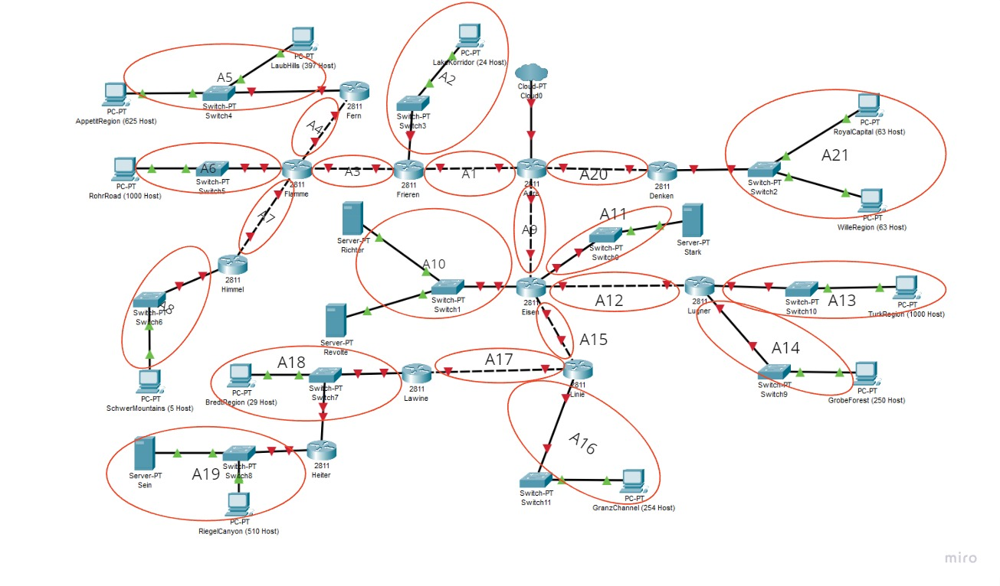
Setelah dihitung jumlah IP dari subnet-subnet di atas, didapat tabel berikut
Subnet | Jumlah IP | Netmask
:---: | :---: | :---:
A1|2|/30
A2|25|/27
A3|2|/30
A4|2|/30
A5|1023|/21
A6|1001|/22
A7|2|/30
A8|6|/29
A9|2|/30
A10|3|/29
A11|2|/30
A12|2|/30
A13|1001|/22
A14|251|/24
A15|2|/30
A16|255|/23
A17|2|/30
A18|31|/26
A19|512|/22
A20|2|/30
A21|127|/24
Total|4255|/19

## VLSM - GNS

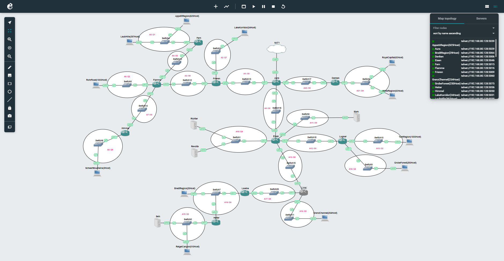

### Penentuan Network ID, Netmask dan Broadcast Address

Berikut pohon subnet yang dibentuk dengan IP `10.28.0.0 /19` sebagai rootnya

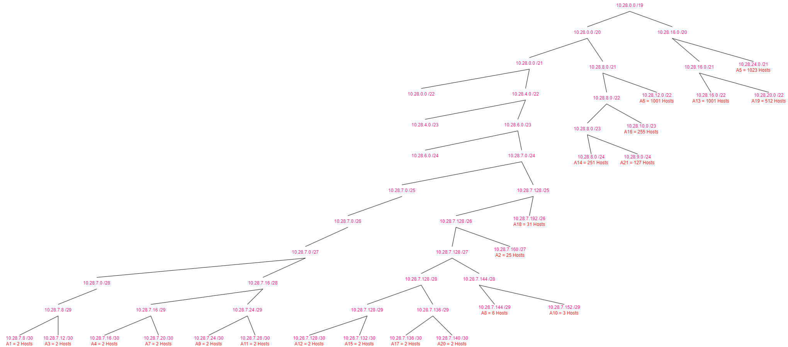

Didapat tabel data setiap subnet, yakni NID dan Netmask. Lalu Broadcast address dapat dicari dengan menggunakan operasi OR pada IP dan Inverted Netmask

### Subnetting

| Subnet | Network ID  |     Netmask     |  Broadcast   |
| :----: | :---------: | :-------------: | :----------: |
|   A1   |  10.28.7.8  | 255.255.255.252 |  10.28.7.11  |
|   A2   | 10.28.7.160 | 255.255.255.224 | 10.28.7.191  |
|   A3   | 10.28.7.12  | 255.255.255.252 |  10.28.7.15  |
|   A4   | 10.28.7.16  | 255.255.255.252 |  10.28.7.19  |
|   A5   | 10.28.24.0  |  255.255.248.0  | 10.28.31.255 |
|   A6   | 10.28.12.0  |  255.255.252.0  | 10.28.15.255 |
|   A7   | 10.28.7.20  | 255.255.255.252 |  10.28.7.23  |
|   A8   | 10.28.7.144 | 255.255.255.248 | 10.28.7.151  |
|   A9   | 10.28.7.24  | 255.255.255.252 |  10.28.7.27  |
|  A10   | 10.28.7.152 | 255.255.255.248 | 10.28.7.159  |
|  A11   | 10.28.7.28  | 255.255.255.252 |  10.28.7.31  |
|  A12   | 10.28.7.128 | 255.255.255.252 | 10.28.7.131  |
|  A13   | 10.28.16.0  |  255.255.252.0  | 10.28.19.255 |
|  A14   |  10.28.8.0  |  255.255.255.0  | 10.28.8.255  |
|  A15   | 10.28.7.132 | 255.255.255.252 | 10.28.7.135  |
|  A16   | 10.28.10.0  |  255.255.254.0  | 10.28.11.255 |
|  A17   | 10.28.7.136 | 255.255.255.252 | 10.28.7.139  |
|  A18   | 10.28.7.192 | 255.255.255.192 | 10.28.7.255  |
|  A19   | 10.28.20.0  |  255.255.252.0  | 10.28.23.255 |
|  A20   | 10.28.7.140 | 255.255.255.252 | 10.28.7.143  |
|  A21   |  10.28.9.0  |  255.255.255.0  | 10.28.9.255  |

### Routing

- **Aura**

```bash
#NAT
auto eth0
iface eth0 inet dhcp

#A1
auto eth1
iface eth1 inet static
	address 10.28.7.9
	netmask 255.255.255.252

#A9
auto eth2
iface eth2 inet static
	address 10.28.7.25
	netmask 255.255.255.252

#A20
auto eth3
iface eth3 inet static
	address 10.28.7.141
	netmask 255.255.255.252

route add -net 10.28.7.152 netmask 255.255.255.248 gw 10.28.7.26
route add -net 10.28.7.160 netmask 255.255.255.224 gw 10.28.7.10
route add -net 10.28.24.0 netmask 255.255.248.0 gw 10.28.7.10
route add -net 10.28.12.0 netmask 255.255.252.0 gw 10.28.7.10
route add -net 10.28.7.144 netmask 255.255.255.248 gw 10.28.7.10
route add -net 10.28.9.0 netmask 255.255.255.0 gw 10.28.7.141
route add -net 10.28.10.0 netmask 255.255.254.0 gw 10.28.7.26
route add -net 10.28.7.192 netmask 255.255.255.192 gw 10.28.7.26
route add -net 10.28.20.0 netmask 255.255.252.0 gw 10.28.7.26
route add -net 10.28.7.28 netmask 255.255.255.252 gw 10.28.7.26
```

- **Frieren**

```bash
#A1
auto eth0
iface eth0 inet static
	address 10.28.7.10
	netmask 255.255.255.252
	gateway 10.28.7.9

#A3
auto eth1
iface eth1 inet static
	address 10.28.7.13
	netmask 255.255.255.252

#A2
auto eth2
iface eth2 inet static
	address 10.28.7.161
	netmask 255.255.255.224

route add -net 10.28.24.0 netmask 255.255.248.0 gw 10.28.7.14
route add -net 10.28.7.144 netmask 255.255.255.248 gw 10.28.7.14
route add -net 10.28.7.152 netmask 255.255.255.248 gw 10.28.7.9
route add -net 10.28.12.0 netmask 255.255.252.0 gw 10.28.7.14
route add -net 10.28.16.0 netmask 255.255.255.252 gw 10.28.7.9
route add -net 10.28.8.0 netmask 255.255.255.0 gw 10.28.7.9
route add -net 10.28.10.0 netmask 255.255.254.0 gw 10.28.7.9
route add -net 10.28.7.192 netmask 255.255.255.192 gw 10.28.7.9
route add -net 10.28.20.0 netmask 255.255.252.0 gw 10.28.7.9
route add -net 10.28.9.0 netmask 255.255.255.0 gw 10.28.7.9
```

- **Flamme**

```bash
#A3
auto eth0
iface eth0 inet static
	address 10.28.7.14
	netmask 255.255.255.252
	gateway 10.28.7.13

#A4
auto eth1
iface eth1 inet static
	address 10.28.7.17
	netmask 255.255.255.252

#A6
auto eth2
iface eth2 inet static
	address 10.28.12.1
	netmask 255.255.252.0

#A7
auto eth3
iface eth3 inet static
	address 10.28.7.21
	netmask 255.255.255.252

route add -net 10.28.7.160 netmask 255.255.255.224 gw 10.28.7.13
route add -net 10.28.24.0 netmask 255.255.248.0 gw 10.28.7.18
route add -net 10.28.7.144 netmask 255.255.255.248 gw 10.28.7.22
route add -net 10.28.7.152 netmask 255.255.255.248 gw 10.28.7.13
route add -net 10.28.16.0 netmask 255.255.255.252 gw 10.28.7.13
route add -net 10.28.8.0 netmask 255.255.255.0 gw 10.28.7.13
route add -net 10.28.10.0 netmask 255.255.254.0 gw 10.28.7.13
route add -net 10.28.7.192 netmask 255.255.255.192 gw 10.28.7.13
route add -net 10.28.20.0 netmask 255.255.252.0 gw 10.28.7.13
route add -net 10.28.9.0 netmask 255.255.255.0 gw 10.28.7.13
```

- **Fern**

```bash
#A4
auto eth0
iface eth0 inet static
	address 10.28.7.18
	netmask 255.255.255.252
	gateway 10.28.7.16

#A5
auto eth1
iface eth1 inet static
	address 10.28.24.1
	netmask 255.255.248.0

route add -net 10.28.7.160 netmask 255.255.255.224 gw 10.28.7.17
route add -net 10.28.12.0 netmask 255.255.252.0 gw 10.28.7.17
route add -net 10.28.7.144  netmask 255.255.255.248 gw 10.28.7.17
route add -net 10.28.7.152 netmask 255.255.255.248 gw 10.28.7.17
route add -net 10.28.7.28 netmask 255.255.255.252 gw 10.28.7.17
route add -net 10.28.16.0 netmask 255.255.255.252 gw 10.28.7.17
route add -net 10.28.8.0 netmask 255.255.255.0 gw 10.28.7.17
route add -net 10.28.10.0 netmask 255.255.254.0 gw 10.28.7.17
route add -net 10.28.7.192 netmask 255.255.255.192 gw 10.28.7.17
route add -net 10.28.20.0 netmask 255.255.252.0 gw 10.28.7.17
route add -net 10.28.9.0 netmask 255.255.255.0 gw 10.28.7.17
```

- **Himmel**

```bash
#A7
auto eth0
iface eth0 inet static
	address 10.28.7.22
	netmask 255.255.255.252
	gateway 10.28.7.21

#A8
auto eth1
iface eth1 inet static
	address 10.28.7.145
	netmask 255.255.255.248

route add -net 10.28.24.0 netmask 255.255.248.0 gw 10.28.7.21
route add -net 10.28.12.0 netmask 255.255.252.0 gw 10.28.7.21
route add -net 10.28.7.160 netmask 255.255.255.224 gw 10.28.7.21
route add -net 10.28.7.152 netmask 255.255.255.248 gw 10.28.7.21
route add -net 10.28.16.0 netmask 255.255.255.252 gw 10.28.7.21
route add -net 10.28.8.0 netmask 255.255.255.0 gw 10.28.7.21
route add -net 10.28.10.0 netmask 255.255.254.0 gw 10.28.7.21
route add -net 10.28.7.192 netmask 255.255.255.192 gw 10.28.7.21
route add -net 10.28.20.0 netmask 255.255.252.0 gw 10.28.7.21
route add -net 10.28.9.0 netmask 255.255.255.0 gw 10.28.7.21
```

- **Eisen**

```bash
#A9
auto eth0
iface eth0 inet static
	address 10.28.7.26
	netmask 255.255.255.252
	gateway 10.28.7.25

#A10
auto eth1
iface eth1 inet static
	address 10.28.7.153
	netmask 255.255.255.248

#A15
auto eth2
iface eth2 inet static
	address 10.28.7.133
	netmask 255.255.255.252

#A12
auto eth3
iface eth3 inet static
	address 10.28.7.129
	netmask 255.255.255.252

#A11
auto eth4
iface eth4 inet static
	address 10.28.7.29
	netmask 255.255.255.252

route add -net 10.28.7.160 netmask 255.255.255.224 gw 10.28.7.25
route add -net 10.28.24.0 netmask 255.255.248.0 gw 10.28.7.25
route add -net 10.28.12.0 netmask 255.255.252.0 gw 10.28.7.25
route add -net 10.28.7.144 netmask 255.255.255.248 gw 10.28.7.25
route add -net 10.28.9.0 netmask 255.255.255.0 gw 10.28.7.25
route add -net 10.28.16.0 netmask 255.255.252.0 gw 10.28.7.130
route add -net 10.28.8.0 netmask 255.255.255.0 gw 10.28.7.130
route add -net 10.28.10.0 netmask 255.255.254.0 gw 10.28.7.134
route add -net 10.28.7.192 netmask 255.255.255.192 gw 10.28.7.134
route add -net 10.28.20.0 netmask 255.255.252.0 gw 10.28.7.134
```

- **Lugner**

```bash
#A12
auto eth0
iface eth0 inet static
	address 10.28.7.130
	netmask 255.255.255.252
	gateway 10.28.7.129

#A14
auto eth1
iface eth1 inet static
	address 10.28.8.1
	netmask 255.255.255.0

#A13
auto eth2
iface eth2 inet static
	address 10.28.16.1
	netmask 255.255.252.0

route add -net 10.28.7.160 netmask 255.255.255.224 gw 10.28.7.129
route add -net 10.28.24.0 netmask 255.255.248.0 gw 10.28.7.129
route add -net 10.28.12.0 netmask 255.255.252.0 gw 10.28.7.129
route add -net 10.28.7.144 netmask 255.255.255.248 gw 10.28.7.129
route add -net 10.28.9.0 netmask 255.255.255.0 gw 10.28.7.129
route add -net 10.28.10.0 netmask 255.255.254.0 gw 10.28.7.129
route add -net 10.28.7.192 netmask 255.255.255.192 gw 10.28.7.129
route add -net 10.28.20.0 netmask 255.255.252.0 gw 10.28.7.129
route add -net 10.28.7.28 netmask 255.255.255.252 gw 10.28.7.129
route add -net 10.28.7.152 netmask 255.255.255.248 gw 10.28.7.129
```

- **Linie**

```bash
#A15
auto eth0
iface eth0 inet static
	address 10.28.7.134
	netmask 255.255.255.252
	gateway 10.28.7.133

#A17
auto eth1
iface eth1 inet static
	address 10.28.7.137
	netmask 255.255.255.252

#A16
auto eth2
iface eth2 inet static
	address 10.28.10.1
	netmask 255.255.254.0

route add -net 10.28.16.0 netmask 255.255.252.0 gw 10.28.7.133
route add -net 10.28.8.0 netmask 255.255.255.0 gw 10.28.7.133
route add -net 10.28.7.160 netmask 255.255.255.224 gw 10.28.7.133
route add -net 10.28.24.0 netmask 255.255.248.0 gw 10.28.7.133
route add -net 10.28.12.0 netmask 255.255.252.0 gw 10.28.7.133
route add -net 10.28.7.144 netmask 255.255.255.248 gw 10.28.7.133
route add -net 10.28.9.0 netmask 255.255.255.0 gw 10.28.7.133
route add -net 10.28.7.192 netmask 255.255.255.192 gw 10.28.7.138
route add -net 10.28.20.0 netmask 255.255.252.0 gw 10.28.7.138
route add -net 10.28.7.28 netmask 255.255.255.252 gw 10.28.7.133
route add -net 10.28.7.152 netmask 255.255.255.248 gw 10.28.7.137
```

- **Lawine**

```bash
#A17
auto eth0
iface eth0 inet static
	address 10.28.7.138
	netmask 255.255.255.252
	gateway 10.28.7.137

#A18
auto eth1
iface eth1 inet static
	address 10.28.7.193
	netmask 255.255.255.192

route add -net 10.28.20.0 netmask 255.255.252.0 gw 10.28.7.195
route add -net 10.28.10.0 netmask 255.255.254.0 gw 10.28.7.137
route add -net 10.28.16.0 netmask 255.255.252.0 gw 10.28.7.137
route add -net 10.28.8.0 netmask 255.255.255.0 gw 10.28.7.137
route add -net 10.28.7.160 netmask 255.255.255.224 gw 10.28.7.137
route add -net 10.28.24.0 netmask 255.255.248.0 gw 10.28.7.137
route add -net 10.28.12.0 netmask 255.255.252.0 gw 10.28.7.137
route add -net 10.28.7.144 netmask 255.255.255.248 gw 10.28.7.137
route add -net 10.28.9.0 netmask 255.255.255.0 gw 10.28.7.137
route add -net 10.28.7.152 netmask 255.255.255.248 gw 10.28.7.137
route add -net 10.28.7.28 netmask 255.255.255.252 gw 10.28.7.137
```

- **Heiter**

```bash
#A18
auto eth0
iface eth0 inet static
	address 10.28.7.195
	netmask 255.255.255.192
	gateway 10.28.7.193

#A19
auto eth1
iface eth1 inet static
	address 10.28.20.1
	netmask 255.255.252.0

route add -net 10.28.16.0 netmask 255.255.252.0 gw 10.28.7.193
route add -net 10.28.8.0 netmask 255.255.255.0 gw 10.28.7.193
route add -net 10.28.7.160 netmask 255.255.255.224 gw 10.28.7.193
route add -net 10.28.24.0 netmask 255.255.248.0 gw 10.28.7.193
route add -net 10.28.12.0 netmask 255.255.252.0 gw 10.28.7.193
route add -net 10.28.7.144 netmask 255.255.255.248 gw 10.28.7.193
route add -net 10.28.9.0 netmask 255.255.255.0 gw 10.28.7.193
route add -net 10.28.7.28 netmask 255.255.255.252 gw 10.28.7.193
route add -net 10.28.7.152 netmask 255.255.255.248 gw 10.28.7.193
route add -net 10.28.10.0 netmask 255.255.254.0 gw 10.28.7.193
```

- **Denken**

```bash
#A20
auto eth0
iface eth0 inet static
	address 10.28.7.142
	netmask 255.255.255.252
	gateway 10.28.7.141

#A21
auto eth1
iface eth1 inet static
	address 10.28.9.1
	netmask 255.255.255.0

route add -net 10.28.16.0 netmask 255.255.252.0 gw 10.28.7.141
route add -net 10.28.8.0 netmask 255.255.255.0 gw 10.28.7.141
route add -net 10.28.7.160 netmask 255.255.255.224 gw 10.28.7.141
route add -net 10.28.24.0 netmask 255.255.248.0 gw 10.28.7.141
route add -net 10.28.12.0 netmask 255.255.252.0 gw 10.28.7.141
route add -net 10.28.7.144 netmask 255.255.255.248 gw 10.28.7.141
route add -net 10.28.7.192 netmask 255.255.255.192 gw 10.28.7.141
route add -net 10.28.20.0 netmask 255.255.252.0 gw 10.28.7.141
route add -net 10.28.7.28 netmask 255.255.255.252 gw 10.28.7.141
route add -net 10.28.7.152 netmask 255.255.255.248 gw 10.28.7.141
```

## CIDR - CPT

### Penggabungan Subnet

Berikut penggabungan subnet dengan metode CIDR
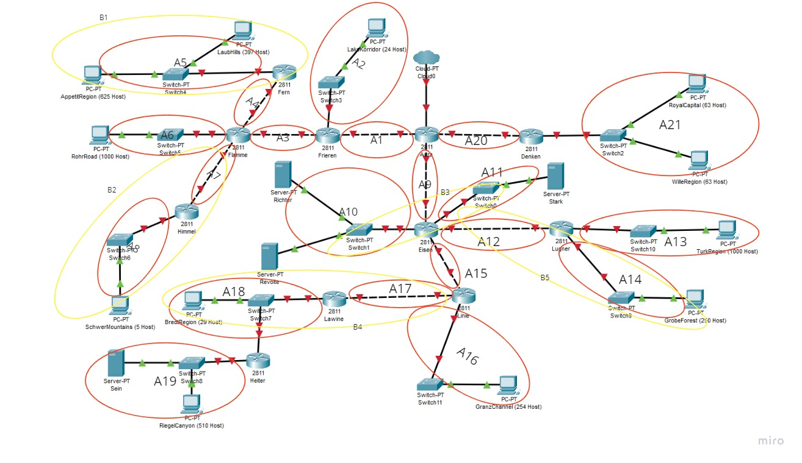
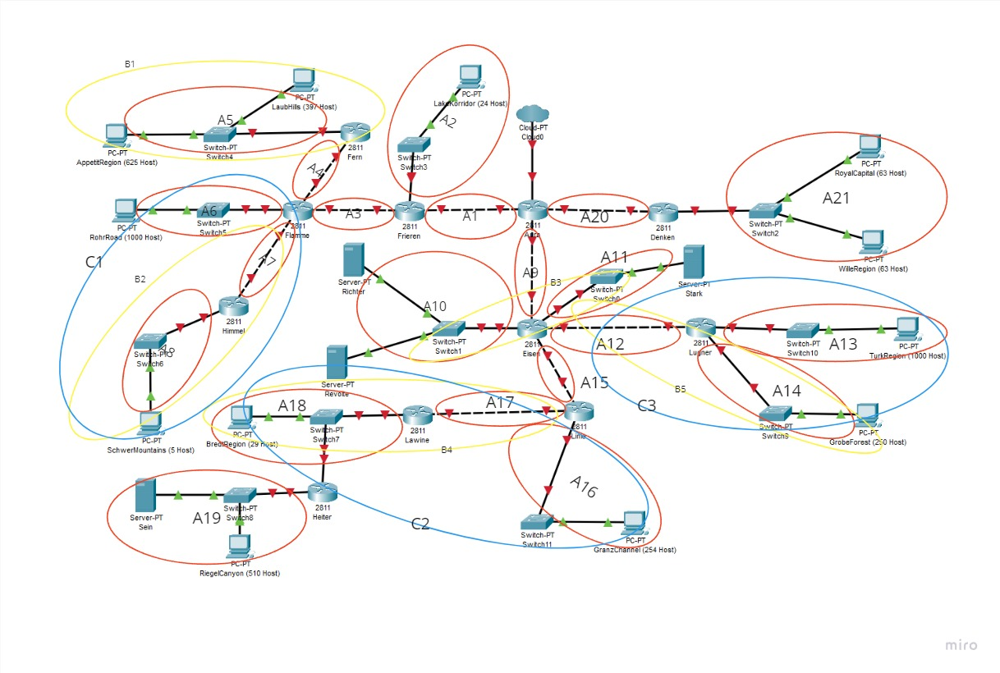
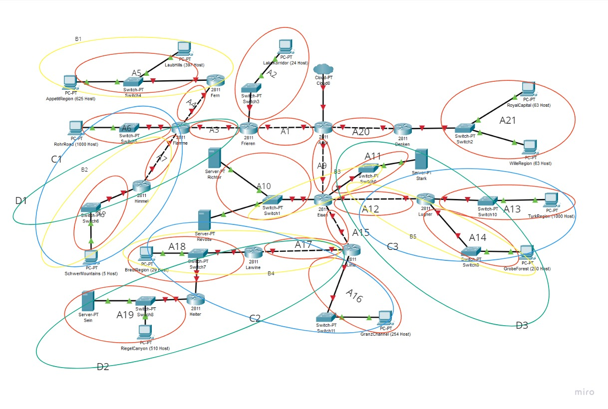

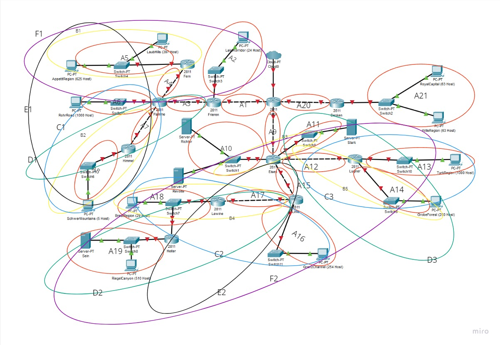
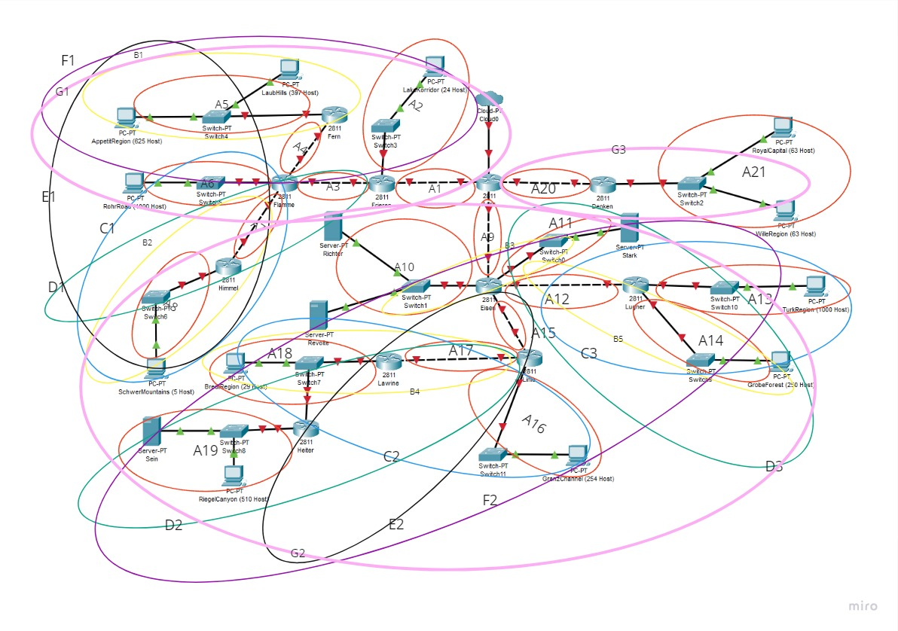
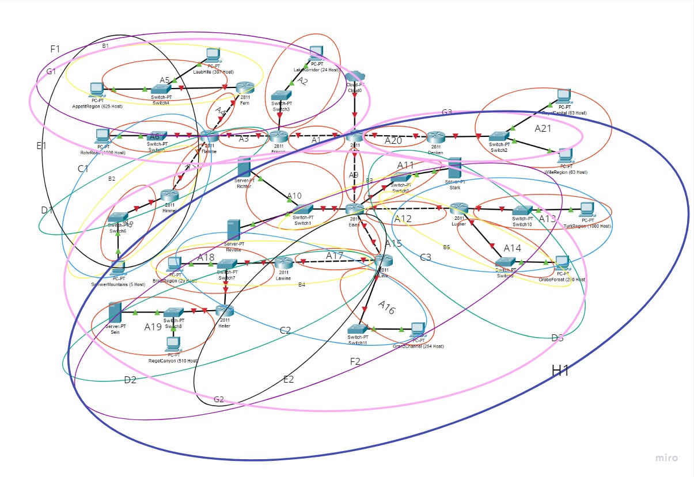
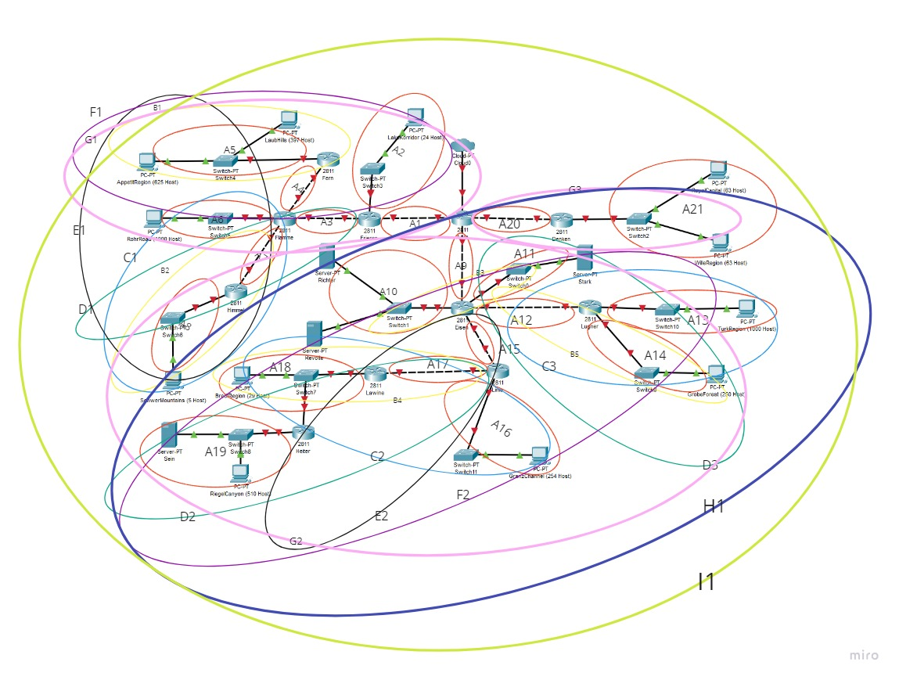

### Penentuan Network ID, Netmask dan Broadcast Address

Berikut pohon subnet yang dibentuk sesuai dengan penggabungan subnet sebelumnya
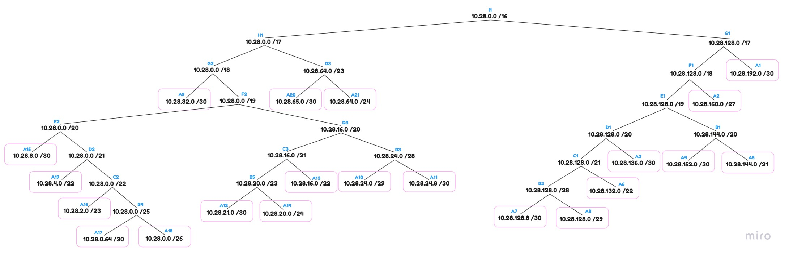

Didapat tabel data setiap subnet, yakni NID dan Netmask. Lalu Broadcast address dapat dicari dengan menggunakan operasi OR pada IP dan Inverted Netmask

| Subnet | Network ID  |     Netmask     |   Broadcast   |
| :----: | :---------: | :-------------: | :-----------: |
|   A1   | 10.28.192.0 | 255.255.255.252 |  10.28.192.3  |
|   A2   | 10.28.160.0 | 255.255.255.224 | 10.28.160.31  |
|   A3   | 10.28.136.0 | 255.255.255.252 |  10.28.136.3  |
|   A4   | 10.28.152.0 | 255.255.255.252 |  10.28.152.3  |
|   A5   | 10.28.144.0 |  255.255.248.0  | 10.28.151.255 |
|   A6   | 10.28.132.0 |  255.255.252.0  | 10.28.135.255 |
|   A7   | 10.28.128.8 | 255.255.255.252 | 10.28.128.11  |
|   A8   | 10.28.128.0 | 255.255.255.248 |  10.28.128.7  |
|   A9   | 10.28.32.0  | 255.255.255.252 |  10.28.32.3   |
|  A10   | 10.28.24.0  | 255.255.255.248 |  10.28.24.7   |
|  A11   | 10.28.24.8  | 255.255.255.252 |  10.28.24.11  |
|  A12   | 10.28.21.0  | 255.255.255.252 |  10.28.21.3   |
|  A13   | 10.28.16.0  |  255.255.252.0  | 10.28.19.255  |
|  A14   | 10.28.20.0  |  255.255.255.0  | 10.28.20.255  |
|  A15   |  10.28.8.0  | 255.255.255.252 |   10.28.8.3   |
|  A16   |  10.28.2.0  |  255.255.254.0  |  10.28.3.255  |
|  A17   | 10.28.0.64  | 255.255.255.252 |  10.28.0.67   |
|  A18   |  10.28.0.0  | 255.255.255.192 |  10.28.0.63   |
|  A19   |  10.28.4.0  |  255.255.252.0  |  10.28.7.255  |
|  A20   | 10.28.65.0  | 255.255.255.252 |  10.28.65.3   |
|  A21   | 10.28.64.0  |  255.255.255.0  | 10.28.64.255  |

### Topologi CPT

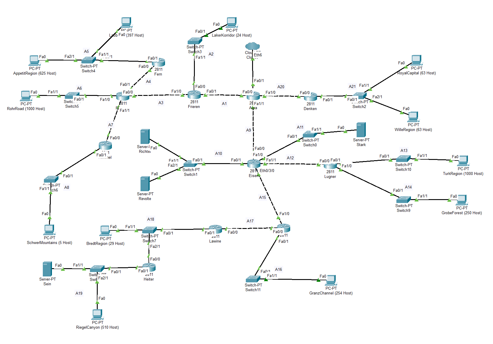

### Subnetting

Setelah dihitung ip untuk tiap subnet, maka sekarang saatnya mengatur ip pada tiap router, client dan server. Setiap interface node diatur sesuai ip yang telah dihitung melalui GUI aplikasi.

#### Aura

```
FastEthernet0/0
FastEthernet0/1
FastEthernet1/0
FastEthernet1/1
```

### Routing

Setelah pengaturan IP selesai, dilanjutkan dengan routing pada router-router seperti berikut.
